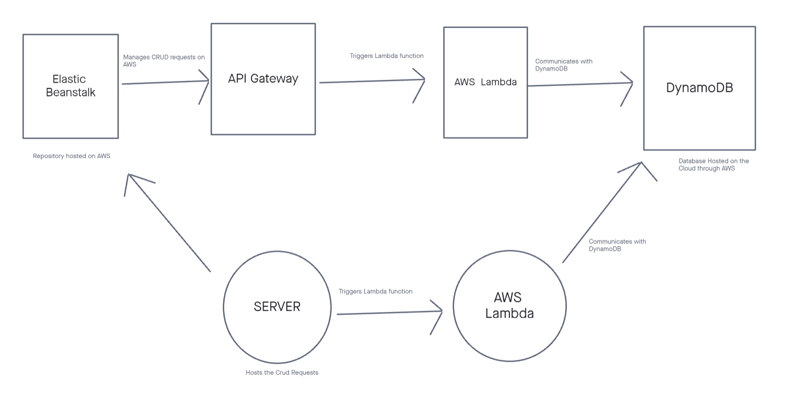

# aws-dynamodb

## Overview

Set up a RESTful API using AWS API Gateway. Resources and methods are created on the API Gateway and attached to lambda functions. Each request made to the server triggers a different lambda function. The project also used DynamoDB. The DB stores coffee orders with the brew and size. The lambda functions are used by dynamoose to interact with DynamoDB.

## Routes

### GET

- GET /coffee
- returns a list of all coffee orders

</br>

- GET /coffee/:id
- find order by id, provide id as a parameter in the URL

### POST

- POST /coffee
- add an order to the database
- sample body

```js
{
  id: "1"
  brew: "Pumpkin Spice Latte",
  size: "Venti"
}
```

- id, brew and size are required in the body

```
Expected Response: "Your Venti Pumpkin Spice Latte is ready."
```

### PUT

- PUT /coffee/:id
- updates an order by id
- include the id in the URL and the updated order in the body

### DELETE

- DELETE /coffee/:id
- delete an order by id, by including the id as a parameter in URL

## UML


